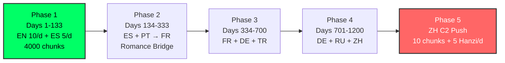

# 🌍 Polyglot Mastery — 8 Languages
### *Execution Dashboard | Obsidian Luxury Edition*

> [!abstract] **Mission**
> **Native:** Arabic Egyptian (C2) — base, not counted
> **Target:** 8 languages → **67,500 chunks** + 5,000 Hanzi
> **System:** Obsidian only · **Street IPA** only · 15 chunks/day
> **Rule:** First 2,000 chunks = 80% of daily speech. Get B1 first, then scale.

---

## 💎 MASTER NUMBERS

> [!info]+ **The Math — No Guessing**
> | Level | Chunks | Days @15/d | 5d/week | Time |
> |---|---|---:|---:|---|
> | **B1** Survival | 2,000 | 133 | 190d | **6.5 months** |
> | **B2** Fluent | 5,500 | 366 | 523d | **18 months** |
> | **C1** Pro | 8,000 | 533 | 762d | **26 months** |
> | **C2** Mastery | 11,000 | 733 | 1047d | **36 months** |
>
> **Daily:** 15 new + 150-250 reviews = **90 min max**
> **Weekly:** 75 new (Mon-Fri) · Sat-Sun = reviews + activation only
> **If reviews > 250 → 0 new that day.** Clear backlog first.

|  #  | Language        | Dialect                  | Level | Chunks                 | Focus                         |
| :-: | --------------- | ------------------------ | ----- | ---------------------- | ----------------------------- |
|  1  | 🇺🇸 English    | General American CA      | C2    | 11,000                 | Work + Idioms + Sarcasm       |
|  2  | 🇲🇽 Spanish    | Mexican CDMX             | C2    | 10,000                 | LatAm Business                |
|  3  | 🇨🇳 Chinese    | Mandarin + Beijing erhua | C2    | 13,000 + 5,000 Hanzi   | Future Business               |
|  4  | 🇫🇷 French     | Parisian                 | C1    | 8,000                  | Africa + Work                 |
|  5  | 🇩🇪 German     | Hannover Hochdeutsch     | C1    | 8,500                  | Engineering                   |
|  6  | 🇷🇺 Russian    | Moscow Street            | B2    | 6,000                  | Personal Mastery + Literature |
|  7  | 🇧🇷 Portuguese | Paulista SP              | B2    | 5,500 → **3,000 eff.** | LATAM                         |
|  8  | 🇹🇷 Turkish    | Istanbul Genç            | B2    | 5,500                  | Regional                      |

---

## 🪜 THE LADDER — What to Start

> [!tip] **Never 8 at once. Max 2. One Germanic + One Romance.**



> [!success] **You Start Here**
> **Phase 1 Only:** English 10/day + Spanish 5/day = 15/day
> Goal: EN 2000 + ES 2000 = B1 in both in 133 days. Everything else is locked until then.

---

## ⚡ DAILY EXECUTION — 90 MIN

> [!warning] **Order Matters — Do Reviews First**

- [ ] **0-40m:** `Ctrl+P → Spaced Repetition: Review flashcards` — ALL due first
- [ ] **40-65m:** Create **15** new chunks from template
- [ ] **65-80m:** Street IPA — Find real audio (YouGlish/Forvo) → transcribe what you *hear* → record yourself
- [ ] **80-90m:** Activation — 2-min voice note using 5 new chunks + write 3 sentences

> [!example] **Weekly Rhythm**
> **Mon-Fri:** 15 new + reviews
> **Sat:** 0 new — reviews + 15-min conversation using week's 75 chunks
> **Sun:** 0 new — reviews + plan next week's 75 chunks

---

## 🗣️ STREET IPA — Real People Only

> [!danger] **Dictionary IPA is fake.** Natives link, delete, and swallow sounds. We learn what is *heard*.

| Language | Book Says | Street Says | Rule |
|---|---|---|---|
| 🇺🇸 `Let's circle back` | /lɛts/ | **[lɛs]** | t-deletion in cluster |
| 🇺🇸 `What's up?` | /wɑts ʌp/ | **[sʌp]** | What disappears |
| 🇺🇸 `meet you` | /mit ju/ | **[miːtʃə]** | t+y → ch |
| 🇲🇽 `¿Qué onda?` | /ke onda/ | **[ˈkʰe ˈonda]** merged | fast linking |
| 🇲🇽 `para` | /paɾa/ | **[pa]** | pa' |
| 🇫🇷 `Je ne sais pas` | /ʒə nə sɛ pa/ | **[ʃɛ pa]** | ne deleted, je→ʃ |
| 🇩🇪 `nicht` | /nɪçt/ | **[nɪʃ]** | swallowed |
| 🇷🇺 `хорошо` | /xoroʂo/ | **[xrɐˈʂo]** | akanie: o→a |
| 🇧🇷 `Prazer` | /pɾazeʁ/ | **[pɾaˈzeɹ]** | Paulista r = [ɹ] |
| 🇹🇷 `Tanıştığımıza` | long | **[tʰɑnɯʃtɯːmzɑ]** | vowel drop |
| 🇨🇳 `谢谢` | /ɕiɛ˥˩ ɕiɛ/ | **[ɕiɛɕiɛ]** flat | tones flattened fast |

**Workflow per chunk:** YouGlish (filter dialect) → listen 0.75x ×3 → transcribe what you hear → note rule → record yourself.

---

## 📁 OBSIDIAN SYSTEM

> [!info] **3 Plugins Only**
> 1. **Spaced Repetition** by Stephen Mw — *replaces Anki*
> 2. **Dataview**
> 3. **Templater**
>
> **SR Settings:** Tags = `#flashcard` · Order = Random · Bury siblings = ON · Max new = 15 · Max reviews = 9999 · Convert folders to decks = ON

**Suggested structure** — *you will tell me the master folder next, I will rewrite all paths:*

```
Polyglot/
├── 00 - Dashboard.md ← this note
├── 01 - Templates/
│   ├── Chunk-Template.md
│   └── Daily-Template.md
├── 02 - Languages/
│   ├── EN-US/ ES-MX/ PT-BR/ FR-FR/ DE-DE/ RU-RU/ TR-TR/ ZH-CN/Hanzi/
├── 03 - Daily/
├── 04 - Audio/
└── 05 - Reviews/
```

---

## 📝 TEMPLATES — Copy & Use

> [!question]- **Chunk-Template.md** — click to expand
>
> ```md
> ---
> language: EN
> dialect: General American CA
> topic: Work & Business
> level: C2
> chunk_id: EN-WORK-0001
> tags: [chunk, flashcards]
> ---
> 
> # {{title}}
> 
> > Chunk: Let's circle back on this
> > AR: خلينا نرجع للموضوع ده بعدين
> > Context: Postpone in meeting
> 
> ### 🗣️ Pronunciation
> | Type | IPA | Audio |
> |---|---|---|
> | Dictionary | /lɛts ˈsɝkl bæk ɑn ðɪs/ |  |
> | **Street REAL** | **[lɛs ˈsɚkl̩ bæk]** | ![[../04 - Audio/EN-WORK-0001-street.mp3]] |
> | My attempt | [ ] | ![[../04 - Audio/EN-WORK-0001-my.mp3]] |
> **Why:** t-deletion, syllabic r, linking
> 
> ### Usage
> - Let's circle back after client feedback.
> - Can we circle back tomorrow?
> 
> ### Flashcards
> Q: How do you REALLY say "Let's circle back" like CA native? Street IPA? #flashcard
> A: [lɛs ˈsɚkl̩ bæk] — t deleted. AR: خلينا نرجع لها بعدين
> <!--SR:!2026-09-30,4,250-->
> 
> Q: When to use it? #flashcard
> A: To postpone discussion in meeting.
> <!--SR:!2026-09-30,4,250-->
> 
> ### ✅ Activation
> - [ ] Writing: 
> - [ ] Voice note:
> - [ ] Real person:
> - [ ] Shadowed 5x: [ ]
> ```

> [!question]- **Daily-Template.md** — click to expand
>
> ```md
> ---
> date: <% tp.file.creation_date("YYYY-MM-DD") %>
> phase: 1
> new_target: 15
> tags: [daily]
> ---
> # Day <% tp.file.creation_date("YYYY-MM-DD") %>
> ## 1. Reviews (40m)
> - SR: X / Y · Hardest:
> ## 2. 15 New (25m)
> ### EN-US 10
> - [ ] [[ ]] — Street:
> ### ES-MX 5
> - [ ] [[ ]] — Street:
> ## 3. Street IPA (15m)
> - [ ] Real audio found · [ ] Transcribed · [ ] Recorded
> ## 4. Activation (10m)
> - [ ] 2-min voice note · [ ] 3 sentences
> ```

---

## 📚 FULL BREAKDOWN — 67,500

> [!example]- 🇺🇸 **ENGLISH US (C2) — 11,000** — click to expand
>
> | Topic | Chunks | Example | Street REAL |
> |---|---:|---|---|
> | Greetings | 440 | What's up? | [sʌp] |
> | Daily Life | 550 | I usually hit the gym at 6 | [aɪ ˈjuʒli hɪɾə dʒɪm əʔ sɪks] |
> | Family | 440 | We're pretty close | [wɚ ˈpɹɪɾi kloʊs] |
> | Travel | 550 | Where is Gate B? | [weɹ ɡeɪʔ bi ɪz] |
> | Food | 550 | Can I get this to go? | [kʰə nɑɪ ɡɛɾ ɪs tə ɡoʊ] |
> | **Work** | **1320** | Let's circle back | [lɛs sɚkl̩ bæk] |
> | Health | 440 | Sharp pain right here | [ʃɑɹp peɪn ɹaɪɾ hɪɹ] |
> | Housing | 330 | Utilities included? | [juɾɪləɾiz ɪnkluːɾɪd] |
> | Culture | 660 | Binge-watched it? | [bɪndʒ wɑtʃt ɪt] |
> | Education | 440 | Gap year | [ɡæp jɪɹ] |
> | Society | 1650 | Climate change | [ˈklaɪmət tʃeɪndʒ ɪz ə ˈpɹɛsɪŋ ɪʃu] |
> | Tech | 1100 | Algorithm biased | [ði ælɡəɹɪðəm ɪz baɪəst] |
> | **Idioms** | **1980** | Not rocket science | [ɪs nɑɾ ɹɑkət saɪəns] |
> | Academic | 550 | Study suggests... | [ðə stʌɾi sədʒɛs ðət] |

> [!example]- 🇲🇽 **SPANISH MX (C2) — 10,000** — click to expand
>
> | Topic | Chunks | Example | Street CDMX |
> |---|---:|---|---|
> | Greetings | 400 | ¿Qué onda? | [ˈkʰe ˈonda] |
> | Daily | 500 | Me levanto temprano | [mleˈβanto temˈpɾano] |
> | Work | 1200 | Darle seguimiento | [ˈðarle seɣiˈmjento] |
> | Slang | 1800 | ¡No manches! | [no ˈmantʃes] |

> [!example]- 🇨🇳 **CHINESE (C2) — 13,000 + 5,000 Hanzi** — click to expand
>
> | Topic | Chunks | Example | Street |
> |---|---:|---|---|
> | Greetings | 520 | 你好 | [ni˧˥ xɑʊ] |
> | Food | 650 | 买单谢谢 | [mɛːdan ɕiɛɕiɛ] |
> | Work | 1560 | 我们回头再讨论 | [womən xweɪtʰou tsai tʰaolun] |
> | Opinions | 2600 | 加油 | [tɕja˥jəʊ] |
> | **Hanzi** | **5000** | 5/day | In sentence, not isolated |

> [!example]- 🇫🇷 **FRENCH (C1) — 8,000** 🇩🇪 **GERMAN (C1) — 8,500** — click to expand
>
> **French:** Work 1200 — *On se cale un call?* [ɔ̃ skal œ̃ kol] · Opinions 720 — *C'est pas sorcier* [sɛ pa sɔʁsje]
> **German:** Work 1360 — *Lass uns nachverfolgen* [las ʊns naxfɐfɔlŋ] · Opinions 765 — *kein Hexenwerk* [kaɪn hɛksn̩vɛɐk]

> [!example]- 🇷🇺 **RUSSIAN (B2) — 6,000** 🇧🇷 **PORTUGUESE (B2) — 5,500** 🇹🇷 **TURKISH (B2) — 5,500** — click to expand
>
> **Russian — Personal Mastery:** *Приятно познакомиться* [prʲɪˈjatnə znɐˈkomʲɪtsə] · *Счёт, пожалуйста* [ɕːot pɐˈʐalstə]
> **Portuguese — 3000 eff. after Spanish:** *Prazer, tudo bem?* [pɾaˈzeɹ tu bẽɪ̃] · *Que daora!* [ki daˈɔɾa]
> **Turkish:** *Tanıştığımıza memnun oldum* [tʰɑnɯʃtɯːmzɑ] · *Hesap lütfen* [heˈsap lytfen]

---

## 📊 TRACKING — Dataview

```dataview
TABLE WITHOUT ID language as "Lang", count(*) as "Total", round(count(*)/67500*100,2)+"%" as "%"
FROM "02 - Languages"
GROUP BY language
SORT count(*) DESC
```

```dataview
TABLE file.link as "Missing Audio", language
FROM "02 - Languages"
WHERE !contains(file.text, "My attempt")
LIMIT 20
```

---

## 🛡️ RULES — Non-Negotiable

> [!danger] **Burnout Protection**
> 1. Reviews >250 → **0 new**
> 2. Min day = reviews only (10 min). No hero days.
> 3. One language per block. Morning = EN, Evening = ES.
> 4. Missed 3 days? 2 days reviews only, then continue.
> 5. Goal = **10 USED/week**, not 100 SEEN.
> 6. No Street IPA + your recording = not done.
> 7. Saturday = activation only. No new.

---

## 🚀 START NOW — First 7 Days

- [ ] **Day 0:** Create folders → Install 3 plugins → Copy 2 templates → Create 3 test chunks:
  - EN: *What's up?* → [sʌp]
  - ES: *¿Qué onda?* → [ˈkʰe ˈonda]
  - EN: *Let's circle back* → [lɛs sɚkl̩ bæk]
- [ ] **Day 1-7:** 15/day = EN 10 + ES 5. Topics: Greetings + Daily Life only. Target: 105 chunks.
- [ ] **Day 30:** 450 chunks. First SR wave done.
- [ ] **Day 100:** EN 2000 + ES 2000. Test: 15-min conversation per language, record it.

> [!success] **Don't chase 67,500. Chase 15 tomorrow.**
> 15 × 5 × 52 = 3,900/year. 2 years = 7,800 = 4 languages at B1.
> **Tell me the master folder name now, and I will rewrite all paths + create the full folder structure for you.**

---
#polyglot #execution #luxury #obsidian-only #street-ipa
